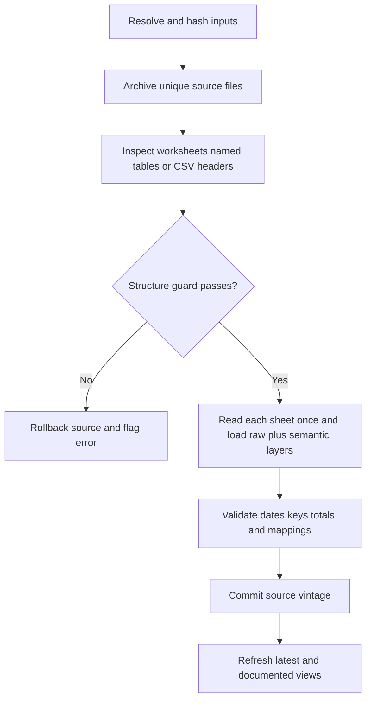

# Architecture

## Design principles

1. **Content determines identity.** A source vintage is `source_id + SHA-256`; execution time is operational metadata only.
2. **Archive before interpretation.** The exact workbook is stored once by hash before parsed values are committed.
3. **Fail closed on semantic change.** Curated parsers and reference tables require successful structure guards.
4. **Separate source observations from meaning.** Raw tables reproduce publications; semantic dimensions document how to interpret source codes and labels.
5. **Keep mappings visible.** Documented views add semantics without removing the source columns used for the join.
6. **Never hide discarded or unmapped content.** Parser omissions and mapping coverage are written to quality outputs.

## Update sequence

Each source is processed inside its own transaction. A failed workbook cannot partially replace the corresponding source, and it does not prevent independent sources from loading.

For `semantic_table` workbooks, raw preservation and semantic extraction share one in-memory list-cell matrix per worksheet. The raw content hash is computed from the same cropped active range used previously, while semantic parsers retain A1-based row and column coordinates. Sheets are processed sequentially, so the 94-sheet Annex is neither read twice nor retained in memory as a whole.

The reference workbook is processed first because bank and finance-company views depend on its dimensions. The source registry order is therefore meaningful.

## Input contracts

- `config/source_registry.csv` declares publisher, format, folder, filename pattern, ingestion mode and semantic status.
- `config/direct_schema.csv` guards the complete worksheet and header sets for bank and finance-company workbooks.
- `config/reference_schema.csv` guards all fifteen semantic-reference tables by worksheet and column signature; display names are hints only.
- `config/specs/*.yml` guards the ICC, EVE and FX layouts using anchors and expected tokens.
- `config/documented_source_contracts.csv` guards semantic-table Excel sources by required sheets, minimum parsed-sheet coverage, observations, lower date bounds, reviewed future horizons and series-disappearance tolerances.
- `config/sheet_modes.csv` holds reviewed parser-mode overrides and hierarchy status by source and sheet.
- `config/long_csv_contracts.csv` guards typed CSV tables by row count, date range, unique key where applicable and required currencies.
- `config/concept_mappings.csv` contains only reviewed cross-source semantic relationships. Automatic source identities are generated separately and never imply equivalence.

## Complex workbook normalization

`scripts/03_curate_documented.R` classifies recurring worksheet layouts by the observed period axis, never by sheet position alone. Annex and payment tables use one of eight explicit orientations: horizontal year, horizontal date, horizontal year-quarter, horizontal year-month, vertical date, vertical year, vertical month/year block or vertical quarter/year block. Each observation retains the source sheet, row and column.

Year-like numeric values are not sufficient evidence of a time axis. Four-digit years may carry a narrowly defined publisher footnote suffix, but a candidate row or column must contain an ordered sequence with plausible gaps. This prevents ordinary exchange rates or monetary values in the 1900–2100 range from displacing the actual year labels.

The credit survey, exchange-house bulletin, insurance fiscal years, daily exchange quotations, row-event tables and compensatory sales use source-specific parsers because their semantics are richer than orientation alone. Row-event identity uses published dimensions first and a value-invariant occurrence lane only when the source omits an operation identifier. Official BIC, entity and currency reference blocks are loaded before observations are joined. The per-sheet outcome is written to `documented_table_catalog`; failure to meet a source contract rolls back that source vintage.

Documented-series identity uses source, worksheet, semantic label path and frequency. Inferred unit and currency are validated attributes rather than key material. A prior-vintage continuity table detects disappeared identities even if source row counts remain unchanged. Positional collision disambiguators are explicitly marked and unresolved additive hierarchy is propagated as a query-visible warning.

Observation construction deliberately separates repeated series metadata from period values. Parsers collect values and coordinates first; unit/scale/currency inference is evaluated over distinct semantic label/title keys and joined back. Identity hashes and participant matches similarly operate over distinct keys. Explicit overrides from specialized parsers always take precedence over inferred metadata.

Long CSVs dispatch through a separate guarded path. They are read as text against an exact header signature, converted with an explicit locale and written at their natural analytical grain. They do not enter the Excel report-cell layer.

Some official exchange-house `.xlsm` worksheets declare Excel row 1,048,576 because of formatted blank cells. XML inspection records both the declared dimension and the bounds containing values, inline strings or formulas. `read_dimensioned_sheet()` reads from A1 only through the last meaningful cell, preserving exact Excel coordinates while preventing million-row allocations.

## Extension rules

A new semantic source must define:

- a stable source identifier and content-vintage policy;
- exact guards for relevant sheets, tables or structural tokens;
- period construction, frequency and publication-date inference;
- separate unit and scale fields;
- currency, index base, hierarchy and total/component behavior;
- explicit discard rules;
- key uniqueness plus at least one range, continuity or accounting check;
- a real-file smoke-test assertion.

Report-style sources use content-addressed worksheet storage. A new vintage always receives a sheet link, but physical cell rows are written only when the sheet-content hash is new. `report_cells` reconstructs the familiar full-vintage representation as a view.

Concepts from different publishers remain distinct until a documented concordance establishes equivalence. No fuzzy match may silently create an analytical mapping.
